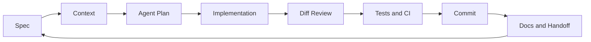

<div align="center">

# Vibe Coding Guide

**Move AI coding from prompt experiments to a reviewable engineering workflow.**

Language: English | [中文](./README.zh-CN.md)

[Start on the Website](https://lling0000.github.io/Vibe_coding_guide/) ·
[English Guide](./vibe-coding-guide-en.md) ·
[中文教程](./vibe-coding-guide-zh.md) ·
[Roadmap](./docs/roadmap.md)

[English PDF](./vibe-coding-guide-en.pdf) ·
[中文 PDF](./vibe-coding-guide-zh.pdf) ·
[Contributing](./CONTRIBUTING.md)


</div>

---

## What This Is

AI coding breaks down when it stays at the prompt-to-code level: vague requests produce plausible diffs, long chats lose context, parallel agents collide, and "looks right" replaces verification.

Vibe Coding Guide solves that gap by treating AI coding as an engineering workflow: a repeatable loop for specifying work, feeding agents the right context, reviewing changes, testing behavior, committing safely, and handing work off. It is not a collection of magic prompts; it is the operating system around AI-assisted development:

- specs that turn vague intent into a contract
- durable project context through `AGENTS.md` / `CLAUDE.md`
- context-window hygiene, compression, handoff, and reset habits
- subagents, workflow patterns, and multi-agent coordination
- git worktrees for parallel agent development
- reusable skills for repeated tasks
- CI, tests, and review habits for agent-written code

The goal is not to "let AI code for you." The goal is to become a stronger operator of AI coding agents.

## Start Here

| If you are... | Start with | What you should do first |
|---|---|---|
| Skimming before starring | [Website](https://lling0000.github.io/Vibe_coding_guide/) | Open the 16-day Feynman checklist and read the first day |
| Reading in English | [vibe-coding-guide-en.md](./vibe-coding-guide-en.md) | Read chapters 1-5 before copying any workflow |
| Reading in Chinese | [README.zh-CN.md](./README.zh-CN.md) | Use the Chinese entry page, then jump into the full guide |
| Using Codex, Claude Code, Cursor, or Aider | Chapters 1-5 | Write one real spec and one project `AGENTS.md` / `CLAUDE.md` |
| Running multiple agents or sessions | Chapters 6-9 | Learn subagents, workflow patterns, `.gitignore`, and worktrees |
| Rolling this out to a team | Chapters 10-13 | Turn repeated work into skills and add CI/testing guardrails |
| Auditing your own habits | Chapters 14-16 | Compare your current workflow against the anti-pattern checklist |

## The Engineering Loop



Vibe Coding works when this loop is explicit. Every phase should leave evidence in files, diffs, command output, tests, or commits.

## How This Differs From a Prompt Guide

| Ordinary prompt guide | Vibe Coding Guide |
|---|---|
| Optimizes a single request | Optimizes the whole engineering loop around the request |
| Asks "what should I type?" | Asks "what system makes agent work reviewable?" |
| Focuses on phrasing | Focuses on specs, context, files, git, CI, tests, and handoff |
| Measures success by a plausible answer | Measures success by a diff that satisfies acceptance checks |
| Treats chat history as memory | Moves durable knowledge into `AGENTS.md`, specs, docs, and skills |
| Relies on manual recovery | Uses worktrees, commits, resets, and review gates to recover cleanly |

## Core Concepts

| Concept | Plain meaning | Why it matters |
|---|---|---|
| Spec | The contract for what the agent should change | Prevents vague work and gives you acceptance criteria |
| Context | The files, rules, history, and examples the agent can use | Keeps the agent focused on the right local reality |
| Agent plan | The proposed route before edits begin | Lets you stop bad direction before it becomes code |
| Subagent | A separate worker for isolated search, review, or analysis | Keeps the main session from filling with unrelated context |
| Workflow | A deterministic sequence of steps around the agent | Makes collaboration repeatable instead of improvised |
| Worktree | A separate checkout for parallel work | Lets multiple agents move without stepping on each other |
| Skill | A reusable task procedure | Turns repeated prompts into maintained operating knowledge |
| CI/testing | Automated evidence that work still behaves | Replaces "looks right" with repeatable verification |

## Learning Paths

**30-minute orientation**

1. Read chapters 1-2 to understand the role shift from typing code to directing agent attention.
2. Skim chapter 3 and write a tiny `AGENTS.md` / `CLAUDE.md` for one repository.
3. Open the website checklist and write a three-minute explanation of the core loop.

**First real project**

1. Write a lightweight spec for a small change.
2. Ask the agent for a plan before edits.
3. Review the diff, run verification, and commit.
4. Record one mistake or local convention back into project docs.

**Parallel agent practice**

1. Read chapters 6-9.
2. Give broad discovery to a subagent or separate session.
3. Put risky implementation in a dedicated git worktree.
4. Merge only after review and tests pass.

**Team adoption**

1. Read chapters 10-13.
2. Convert one repeated workflow into a skill.
3. Add CI rules to the project agent guide.
4. Build a small case library for evaluating agent behavior.

## Chapter Map

| Phase | Chapters | Outcome |
|---|---:|---|
| Foundations | 1-5 | Write better specs, maintain project context, and manage long sessions |
| Coordination | 6-9 | Use subagents, workflow patterns, `.gitignore`, and worktrees |
| Reuse and guardrails | 10-13 | Create skills, separate prompt layers, add CI/CD, and test agent behavior |
| Judgment | 14-16 | Build durable habits and spot failure modes early |

| Chapter | Topic |
|---:|---|
| 1 | What Vibe Coding is and how your role changes |
| 2 | Specs as the starting point for useful agent work |
| 3 | What belongs in `AGENTS.md` / `CLAUDE.md` |
| 4 | Cold-starting new and inherited projects |
| 5 | Context management, compression, handoffs, and resets |
| 6 | Subagents and context isolation |
| 7 | Workflow patterns and multi-agent collaboration |
| 8 | `.gitignore` as repository hygiene |
| 9 | Git worktrees for parallel agent development |
| 10 | Skills as reusable task workflows |
| 11 | System prompts vs user prompts |
| 12 | CI/CD guardrails for agent-written code |
| 13 | Testing ordinary code and testing agent behavior |
| 14 | Advanced operating principles |
| 15 | A complete multi-day workflow example |
| 16 | Anti-patterns checklist |

## Repository Structure

```text
.
├── index.html                 # GitHub Pages checklist and reader entry
├── assets/                    # Site styles, script, and visual asset
├── docs/
│   └── roadmap.md             # Public roadmap and contribution priorities
├── .github/workflows/
│   └── docs.yml               # Docs-only sanity checks for local links
├── README.md                  # English front door
├── README.zh-CN.md            # Chinese front door
├── README_zh.md               # Legacy Chinese entry link
├── CONTRIBUTING.md            # Contribution guide
├── vibe-coding-guide-en.md    # Full English tutorial
├── vibe-coding-guide-en.pdf   # English PDF
├── vibe-coding-guide-zh.md    # Full Chinese tutorial
└── vibe-coding-guide-zh.pdf   # Chinese PDF
```

## Project Status

This is a documentation-first repository. The full bilingual guides and PDFs are already included, and the GitHub Pages site provides a 16-day Feynman-style learning checklist with local browser progress.

There is currently no package manager setup because the site is plain static HTML/CSS/JavaScript. The CI added here only checks repository-facing documentation links; it does not build or publish a package.

## Contributing

Good contributions make the guide more concrete, verifiable, and useful in real workflows. See [CONTRIBUTING.md](./CONTRIBUTING.md) and [docs/roadmap.md](./docs/roadmap.md) before opening a pull request.

## License

This project is licensed under the Creative Commons Attribution 4.0 International License (CC BY 4.0).

You are free to share and adapt the guide, including translations and derivative works, as long as appropriate credit is given.

See [LICENSE](./LICENSE) for details.
