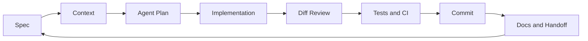

<div align="center">

# Vibe Coding Guide

**Turn AI coding from chaotic prompting into an engineering workflow.**

[Read the English Guide](./vibe-coding-guide-en.md) · [中文 README](./README_zh.md) · [中文教程](./vibe-coding-guide-zh.md)

[Website](https://lling0000.github.io/Vibe_coding_guide/) ·
[English PDF](./vibe-coding-guide-en.pdf) · [中文 PDF](./vibe-coding-guide-zh.pdf)


</div>

---

## Why This Guide Exists

AI coding tools can generate code quickly. The hard part is making that output useful, reviewable, and safe to ship.

This guide teaches **Vibe Coding as an engineering practice**: how to write specs, feed agents the right context, review their work, manage long sessions, use subagents, run parallel worktrees, create reusable skills, and build CI/testing guardrails around agent-written code.

The goal is not to "let AI code for you." The goal is to become a better operator of AI agents.

## Start Here

| If you want to... | Go here |
|---|---|
| Read the full English tutorial | [vibe-coding-guide-en.md](./vibe-coding-guide-en.md) |
| Read the full Chinese tutorial | [vibe-coding-guide-zh.md](./vibe-coding-guide-zh.md) |
| Download the English PDF | [vibe-coding-guide-en.pdf](./vibe-coding-guide-en.pdf) |
| Download the Chinese PDF | [vibe-coding-guide-zh.pdf](./vibe-coding-guide-zh.pdf) |
| Open the Chinese README | [README_zh.md](./README_zh.md) |
| Skim the core workflow first | Chapters 1-5 |
| Learn parallel agent work | Chapters 6-9 |
| Build team-level practice | Chapters 10-13 |
| Audit your habits and anti-patterns | Chapters 14-16 |

## The Core Loop



Vibe Coding works when this loop is explicit. Every phase should be observable, reviewable, and recoverable through files and git.

## What You Will Learn

| Area | Chapters | Outcome |
|---|---:|---|
| Foundations | 1-5 | Write better specs, maintain `AGENTS.md`, and manage context windows |
| Agent Coordination | 6-9 | Use subagents, workflows, multi-agent patterns, `.gitignore`, and worktrees |
| Reusable Practice | 10-13 | Create skills, separate system/user prompts, set up CI/CD, and test agent behavior |
| Judgment | 14-16 | Build durable habits and avoid common failure modes |

## Who This Is For

- Developers using Codex, Claude Code, Cursor, Aider, or similar AI coding tools
- Engineers who want AI agents to fit into a real development workflow
- Teams coordinating specs, sessions, worktrees, reviews, and CI
- Builders creating prompts, skills, subagents, or AI-assisted engineering systems

## Chapter Map

| Chapter | Topic |
|---:|---|
| 1 | What Vibe Coding is and what your role becomes |
| 2 | Specs as the starting point for useful agent work |
| 3 | What belongs in `AGENTS.md` / `CLAUDE.md` |
| 4 | Cold-starting new and inherited projects |
| 5 | Context management, compression, handoffs, and resets |
| 6 | Subagents and context isolation |
| 7 | Workflow patterns and multi-agent collaboration |
| 8 | `.gitignore` as repository hygiene |
| 9 | Git worktrees for parallel agent development |
| 10 | Skills as reusable task workflows |
| 11 | System prompts vs user prompts |
| 12 | CI/CD guardrails for agent-written code |
| 13 | Testing ordinary code and testing agent behavior |
| 14 | Advanced operating principles |
| 15 | A complete multi-day workflow example |
| 16 | Anti-patterns checklist |

## Repository Structure

```text
.
├── index.html                 # GitHub Pages reader website
├── assets/                    # Site styles and client-side Markdown rendering
├── README.md                  # English repository introduction
├── README_zh.md               # Chinese repository introduction
├── vibe-coding-guide-en.md    # Full English tutorial
├── vibe-coding-guide-en.pdf   # English tutorial as PDF
├── vibe-coding-guide-zh.md    # Full Chinese tutorial
└── vibe-coding-guide-zh.pdf   # Chinese tutorial as PDF
```

## How To Use This Guide

Read it like a field manual, not a blog post.

1. Pick one real coding workflow you already do with AI.
2. Write a spec for it.
3. Add the recurring project rules to `AGENTS.md`.
4. Run one small task with an agent.
5. Review the diff, run verification, and commit.
6. Write down what the agent got wrong so the next run improves.

Repeat the loop until your workflow becomes predictable.

## Project Status

This is a documentation-first repository. The current content is complete enough to read end-to-end, but it is expected to evolve as AI coding tools and agent workflows change.

## License

No license has been specified yet. Add one before redistributing or reusing this material in a public project.
