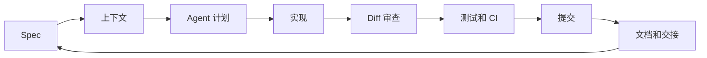

<div align="center">

# Vibe Coding Guide

**把 AI Coding 从 prompt 实验，升级为可审查、可验证、可交付的工程工作流。**

语言： [English](./README.md) | 中文

[网站学习清单](https://lling0000.github.io/Vibe_coding_guide/) ·
[中文完整教程](./vibe-coding-guide-zh.md) ·
[English Guide](./vibe-coding-guide-en.md) ·
[路线图](./docs/roadmap.md)

[中文 PDF](./vibe-coding-guide-zh.pdf) ·
[English PDF](./vibe-coding-guide-en.pdf) ·
[贡献指南](./CONTRIBUTING.md)


</div>

---

## 这是什么

AI Coding 如果停留在 prompt 到代码的玩具阶段，很快就会失控：需求模糊但 diff 看起来合理，长会话丢上下文，并行 Agent 相互踩踏，“看起来没问题”替代了真正验证。

Vibe Coding Guide 解决的就是这个断层：把 AI Coding 当成一套工程工作流来管理，从 spec、上下文、计划、实现、review、测试、提交到交接，都要可重复、可审查、可恢复。它不是 prompt 话术合集，而是 AI 辅助开发周围的完整操作系统：

- 用 spec 把模糊需求变成可验收的契约
- 用 `AGENTS.md` / `CLAUDE.md` 沉淀项目级上下文
- 管理上下文窗口、压缩、交接、重开和复盘
- 使用 subagent、workflow 和多 Agent 协作模式
- 用 git worktree 隔离并行 Agent 开发
- 把重复任务固化为 skill
- 用 CI、测试和 diff review 管住 Agent 写出来的代码

目标不是“让 AI 替你写代码”。目标是让你成为更强的 AI Coding Agent 操作者。

## 快速入口

| 你的状态 | 从这里开始 | 第一件事 |
|---|---|---|
| 想快速判断值不值得收藏 | [网站学习清单](https://lling0000.github.io/Vibe_coding_guide/) | 打开 16 天费曼清单，先看 Day 1 |
| 想系统阅读中文内容 | [vibe-coding-guide-zh.md](./vibe-coding-guide-zh.md) | 先读第 1-5 章，建立基本工作方式 |
| 想阅读英文版本 | [README.md](./README.md) | 从英文首页进入完整教程 |
| 正在用 Codex、Claude Code、Cursor、Aider | 第 1-5 章 | 给一个真实项目写 spec 和 `AGENTS.md` / `CLAUDE.md` |
| 想多 Agent / 多 session 并行 | 第 6-9 章 | 学 subagent、workflow、`.gitignore` 和 worktree |
| 想做团队级落地 | 第 10-13 章 | 把重复任务做成 skill，并补 CI / 测试护栏 |
| 想检查自己的坏习惯 | 第 14-16 章 | 用反模式清单审查自己的日常工作流 |

## 核心工程循环



Vibe Coding 的关键，是让这个循环显性化。每一步都应该留下证据：文件、diff、命令输出、测试结果或 commit。

## 它和普通 Prompt Guide 有什么不同

| 普通 prompt 指南 | Vibe Coding Guide |
|---|---|
| 优化一次提问 | 优化一次提问周围的完整工程循环 |
| 关心“我该怎么说” | 关心“什么系统能让 Agent 的工作可审查” |
| 重点是话术 | 重点是 spec、上下文、文件、git、CI、测试和交接 |
| 用“回答看起来合理”衡量成功 | 用“diff 满足验收标准”衡量成功 |
| 把聊天记录当记忆 | 把长期知识沉淀到 `AGENTS.md`、spec、docs 和 skill |
| 走偏后靠手工补救 | 用 worktree、commit、reset 和 review gate 干净恢复 |

## 核心概念

| 概念 | 一句话解释 | 为什么重要 |
|---|---|---|
| Spec | Agent 要改什么的契约 | 避免模糊任务，提供验收标准 |
| Context | Agent 能使用的文件、规则、历史和例子 | 让 Agent 贴近项目真实情况 |
| Agent plan | 动手前的实施路线 | 在写出代码前拦住错误方向 |
| Subagent | 用于独立搜索、审查或分析的隔离工人 | 避免主会话被无关上下文塞满 |
| Workflow | 围绕 Agent 的确定性步骤编排 | 让协作可复用，而不是临场发挥 |
| Worktree | 独立的 git 工作目录 | 让多个 Agent 并行但互不踩踏 |
| Skill | 可复用的任务流程 | 把重复 prompt 变成可维护的操作知识 |
| CI / 测试 | 可重复的验证证据 | 用自动化代替“看起来没问题” |

## 推荐学习路径

**30 分钟建立方向感**

1. 读第 1-2 章，理解“写字符”到“管理 Agent 注意力”的角色变化。
2. 浏览第 3 章，给一个真实仓库写一个极简 `AGENTS.md` / `CLAUDE.md`。
3. 打开网站学习清单，用 3 分钟讲清楚核心循环。

**第一个真实项目**

1. 给一个小改动写轻量 spec。
2. 要求 Agent 先给计划，再允许它动手。
3. 看 diff，跑验证，提交。
4. 把 Agent 犯过的一个错写回项目文档。

**多 Agent 并行实践**

1. 阅读第 6-9 章。
2. 把大范围搜索、审查或对比交给 subagent / 独立 session。
3. 把风险实现放进独立 git worktree。
4. 只在 review 和测试通过后合并。

**团队级落地**

1. 阅读第 10-13 章。
2. 把一个重复工作流写成 skill。
3. 在项目 Agent 指南中写清 CI 规则。
4. 建一个小型 case 库，用行为证据测试 Agent。

## 章节地图

| 阶段 | 章节 | 结果 |
|---|---:|---|
| 基础 | 1-5 | 写好 spec，维护项目上下文，管理长会话 |
| 协作 | 6-9 | 使用 subagent、workflow、`.gitignore` 和 worktree |
| 复用与护栏 | 10-13 | 创建 skill，区分提示词层级，增加 CI/CD 和行为测试 |
| 判断力 | 14-16 | 建立稳定习惯，提前识别失败模式 |

| 章节 | 主题 |
|---:|---|
| 1 | Vibe Coding 是什么，你的角色怎么变化 |
| 2 | Spec 为什么是一切的起点 |
| 3 | `AGENTS.md` / `CLAUDE.md` 应该写什么 |
| 4 | 新项目和接手项目的冷启动 |
| 5 | 上下文管理、压缩、交接、清零 |
| 6 | Subagent 和上下文隔离 |
| 7 | Workflow 和多 Agent 协作模式 |
| 8 | `.gitignore` 和仓库卫生 |
| 9 | Git worktree 支撑并行开发 |
| 10 | Skill：把重复任务固化成工作流 |
| 11 | System prompt 和 user prompt 的分工 |
| 12 | CI/CD 给 Agent 代码加护栏 |
| 13 | 测普通代码，也测 Agent 行为 |
| 14 | 高阶操作原则 |
| 15 | 一个完整多天工作流示例 |
| 16 | 常见反模式速查 |

## 仓库结构

```text
.
├── index.html                 # GitHub Pages 学习清单和阅读入口
├── assets/                    # 网站样式、脚本和视觉资产
├── docs/
│   └── roadmap.md             # 公开路线图和贡献优先级
├── .github/workflows/
│   └── docs.yml               # 文档内部链接检查
├── README.md                  # 英文仓库首页
├── README.zh-CN.md            # 中文仓库首页
├── README_zh.md               # 旧中文入口链接
├── CONTRIBUTING.md            # 贡献指南
├── vibe-coding-guide-en.md    # 英文完整教程
├── vibe-coding-guide-en.pdf   # 英文 PDF
├── vibe-coding-guide-zh.md    # 中文完整教程
└── vibe-coding-guide-zh.pdf   # 中文 PDF
```

## 项目状态

这是一个文档优先的仓库。当前已经包含完整中英教程、PDF，以及带 16 天费曼学习清单的 GitHub Pages 站点；网站进度保存在浏览器本地。

仓库目前没有 package manager 配置，因为站点是纯静态 HTML/CSS/JavaScript。这里补充的 CI 只检查仓库前门文档的本地链接，不构建或发布包。

## 参与贡献

好的贡献应该让指南更具体、更可验证、更贴近日常工程工作流。提交 PR 前建议先阅读 [CONTRIBUTING.md](./CONTRIBUTING.md) 和 [docs/roadmap.md](./docs/roadmap.md)。

## 许可

当前仓库尚未指定开源许可证。在仓库所有者补充明确 License 前，不应默认拥有除 GitHub 浏览和常规贡献流程之外的再分发或复用权利。
