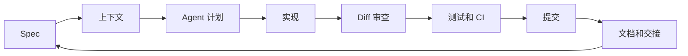

# Vibe Coding Guide

语言版本：[English](./README.md) | 中文

网站版：[https://lling0000.github.io/Vibe_coding_guide/](https://lling0000.github.io/Vibe_coding_guide/)

## 项目介绍

这是一个面向 AI Agent 协作开发的 Vibe Coding 实战教程仓库。

本仓库包含中文原版与英文版本，覆盖从写 spec、维护 AGENTS.md、管理上下文，到 subagent、workflow、worktree、skill、CI/CD 和 Agent 行为测试的完整实践。

这份教程强调的不是“让 AI 自动写代码”，而是如何像工程负责人一样指挥 Agent：给清楚的上下文，拆分任务，审查 diff，沉淀项目知识，用测试和 CI 把 Agent 产出的代码管住。

## 快速开始

| 你想做什么 | 从这里开始 |
|---|---|
| 按 16 天费曼学习清单每日学习 | [网站版](https://lling0000.github.io/Vibe_coding_guide/) |
| 阅读完整中文教程 | [vibe-coding-guide-zh.md](./vibe-coding-guide-zh.md) |
| 阅读完整英文教程 | [vibe-coding-guide-en.md](./vibe-coding-guide-en.md) |
| 下载中文 PDF | [vibe-coding-guide-zh.pdf](./vibe-coding-guide-zh.pdf) |
| 下载英文 PDF | [vibe-coding-guide-en.pdf](./vibe-coding-guide-en.pdf) |
| 查看英文仓库首页 | [README.md](./README.md) |
| 先建立基本工作方式 | 第 1-5 章 |
| 学多 Agent / worktree 并行 | 第 6-9 章 |
| 做团队级规范、Skill、CI | 第 10-13 章 |
| 检查自己的反模式 | 第 14-16 章 |

## 文档

- 中文版：[vibe-coding-guide-zh.md](./vibe-coding-guide-zh.md) · [PDF](./vibe-coding-guide-zh.pdf)
- English version: [vibe-coding-guide-en.md](./vibe-coding-guide-en.md) · [PDF](./vibe-coding-guide-en.pdf)

## 核心循环



Vibe Coding 的关键，是把这个循环做得可观察、可审查、可回滚、可复用。

## 适合谁读

- 正在使用 Codex、Claude Code、Cursor、Aider 等 AI Coding 工具的人
- 想把 AI Agent 纳入日常开发流程的工程师
- 需要组织多个 Agent、多个 worktree 或多个 session 协作的人
- 正在建设团队级 AI coding 规范、skill、CI 和 review 流程的人

## 核心主题

- 如何写清楚 spec，并把验收标准变成 Agent 的工作边界
- 如何维护 AGENTS.md / CLAUDE.md，让项目知识长期沉淀
- 如何管理上下文窗口，什么时候压缩、切换、清零
- 如何使用 subagent、workflow 和多 Agent 协作模式
- 如何用 git worktree 支撑并行开发
- 如何把重复任务固化成 Skill
- 如何区分 system prompt 与 user prompt
- 如何用 CI/CD 和测试约束 Agent 产出的代码质量
- 如何测试 Agent 行为本身，而不只是测试普通代码

## 学习路径

1. 先读中文版或英文版的第 1-5 章，建立 Vibe Coding 的基本工作方式。
2. 如果你要并行开发，重点读第 6-9 章。
3. 如果你要把流程产品化或团队化，重点读第 10-13 章。
4. 最后用第 14-16 章检查自己的日常工作流和反模式。

## 章节地图

| 章节 | 主题 |
|---:|---|
| 1 | Vibe Coding 是什么，你的角色怎么变化 |
| 2 | Spec 为什么是一切的起点 |
| 3 | `AGENTS.md` / `CLAUDE.md` 应该写什么 |
| 4 | 新项目和接手项目的冷启动 |
| 5 | 上下文管理、压缩、交接、清零 |
| 6 | Subagent 和上下文隔离 |
| 7 | Workflow 和多 Agent 协作模式 |
| 8 | `.gitignore` 和仓库卫生 |
| 9 | Git worktree 支撑并行开发 |
| 10 | Skill：把重复任务固化成工作流 |
| 11 | System prompt 和 user prompt 的分工 |
| 12 | CI/CD 给 Agent 代码加护栏 |
| 13 | 测普通代码，也测 Agent 行为 |
| 14 | 高阶心法 |
| 15 | 一个完整多天工作流示例 |
| 16 | 常见反模式速查 |

## 仓库结构

```text
.
├── index.html                 # GitHub Pages 学习清单和阅读网站入口
├── assets/                    # 网站样式、视觉资产和渲染脚本
├── README.md                  # 英文仓库介绍
├── README_zh.md               # 中文仓库介绍
├── vibe-coding-guide-en.md    # 英文完整教程
├── vibe-coding-guide-en.pdf   # 英文教程 PDF
├── vibe-coding-guide-zh.md    # 中文完整教程
└── vibe-coding-guide-zh.pdf   # 中文教程 PDF
```

## 怎么用这份教程

不要把它当成一篇文章读完就算了。网站版已经整理成 16 天费曼学习清单：第 1 天学第 1 部分，第 2 天复习第 1-2 部分，以此类推直到第 16 天；每天都有可勾选的回忆、复述、查漏和应用任务，进度会保存在浏览器里。更好的方式是：

1. 拿一个你正在用 AI 做的真实开发任务。
2. 先写 spec。
3. 把项目里反复出现的约定沉淀到 `AGENTS.md`。
4. 让 Agent 做一个足够小的任务。
5. 看 diff、跑验证、提交。
6. 把 Agent 犯过的错写回文档或规范里。

这个循环跑得越多，Agent 的产出越稳定，你的审查成本越低。

## 许可

当前尚未指定开源许可证。如果要公开复用、转载或二次分发，建议先补充明确的 License。
